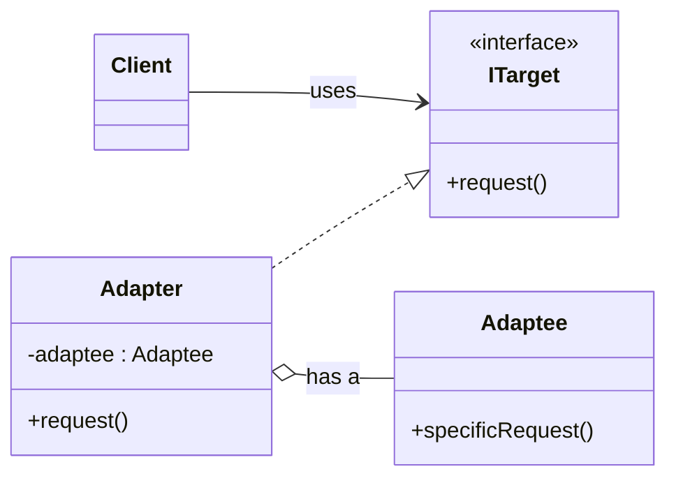

# Adapter Pattern
The Adapter pattern allows a client to work with an incompatible interface by introducing an adapter that translates between the client’s expected interface and the adaptee’s existing interface.

## Overview
Suppose we have a service that needs to use a third‑party library, but the library’s interface is not compatible with our service.
We could keep glue code inside the same class to handle compatibility, but that tightly couples our service to the third‑party library.
Instead, we use an adapter that takes input from our service, talks to the library, and presents a compatible interface back to our service.

## Example
Consider a case where the client needs JSON data, but the third‑party service returns XML.
An adapter can convert the XML data to JSON. After conversion, we simply pass the JSON data to the client.

## Design Approach
In this case, we create an abstract class `Report` that has a virtual method `getJSONData()`.
We also have an `XMLDataProvider` class that provides XML data.
We then create an adapter `XMLDataProviderAdapter` that implements `Report` by overriding `getJSONData()` (forming an `is a` relation).
This adapter also holds an instance of `XMLDataProvider` (forming a `has a` relation).

So here, the adapter is `XMLDataProviderAdapter` and the adaptee is `XMLDataProvider`.

## Standard UML

