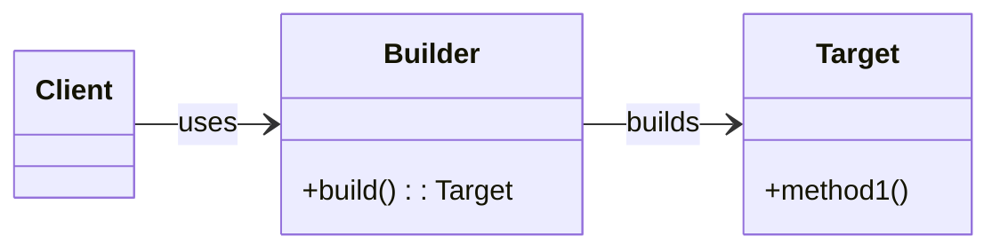
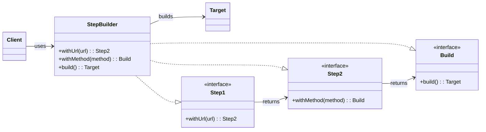

# Builder Pattern
Builder Pattern seperates the construction of a complex object from itsrepresentation.
## HTTP Request Example
To understand this pattern, let's take an example of an HTTP request.

In an HTTP request we can have the following parts:
- URL
- Method
- Headers
- Body
- Query Parameters

To build this `HttpRequest` class, we might create a constructor that takes all these parts as parameters.

## Problems With Telescoping Constructors
- Query parameters and body are optional, so passing them in a single constructor is awkward.
- The client must remember the order of parameters, which is error‑prone.
- This is called constructor telescoping/overloading.

## Mutability Concerns
Another problem is the issue of mutability. In some objects (not in this case) we don't want the client to change the state of the object after it is created.
One might suggest removing the setters and making the class immutable.
But that would require changing existing logic, and it's not always a good practice to simply remove setters.

## Optional Parameters via Setters: Pitfalls
When trying to solve optional parameters:
- Use setters for optional parameters.
- Keep non‑optional parameters in the constructor.
- However, this can cause a critical issue:
  - Let's say query parameters are optional and headers are optional.
  - Object creation may look like `HttpRequest* httpRequest = new HttpRequest(url, method, body);`
  - Optional parameters can be set later: `httpRequest->setQueryParameters(queryParameters);`
  - After this we may call the execute method: `httpRequest->execute();`
  - But what if the client forgets to set query parameters or headers and directly calls `execute()`?
  - The client may not get the desired result, and there will be no compile‑time error.
  - We must ensure the client sets all required parameters before calling `execute()`.
  - This is a problem that the Builder pattern solves.

## Validation Burden
Another problem is validation. We must ensure that all required parameters are set before calling `execute()`, which becomes client overhead.

## UML for Simple Builder Pattern


This is better explained in the code.

## Different Types of Builder Pattern

### Builder with Director
- Create a `Director` class that takes arguments and builds the object using the builder, returning a `Target` object.
- For example, we want a method where the client provides only the URL and the rest is handled by the director.
- Implementation:
```c++
class HttpRequestDirector {
  public:
  static HttpRequest createGetReq(const string& url) {
    return HttpRequestBuilder().withUrl(url).withMethod("GET").build();
  }
};
```
- The client can create a GET request without worrying about other parameters.
- This acts like templates for creating different types of requests.

### Step Builder
- This pattern uses multiple inheritance (which we usually avoid), but here it provides compile‑time sequencing. There is a trade‑off.
- Note: In Java, multiple inheritance is not allowed for concrete classes, but interfaces can be multiply inherited. In C++, abstract classes serve a similar role.

#### Problem Statement
- For `HttpRequestBuilder`, we want the client to provide data in a specific sequence: `url → method → headers → body`.
- Because the builder originally returned itself with all methods available, we couldn’t enforce the desired order.

#### Implementation Overview
- Create pure abstract interfaces for each step: `withUrl`, `withMethod`, `withHeaders`, `withBody`.
- The Step Builder class inherits all these interfaces.
- Each step method returns the interface of the next step, enforcing order at compile time.
- Example flow: `UrlStep.withUrl(...) → MethodStep.withMethod(...) → HeaderStep.withHeader(...) → OptionalStep.withBody/withTimeout → build()`.

#### Important Notes
- Optional fields like `timeout` can be placed in an `OptionalStep` interface that also exposes `build()`.
- At the end of the chain, the client can either call `build()` to finish or call an optional method (like `withTimeout`) and then `build()`.
- Unlike the initial approach where every method returned the builder itself, in the Step Builder each method returns the next step’s interface; `build()` returns the `HttpRequest`.

Following shows the UML for the Step Builder pattern:




