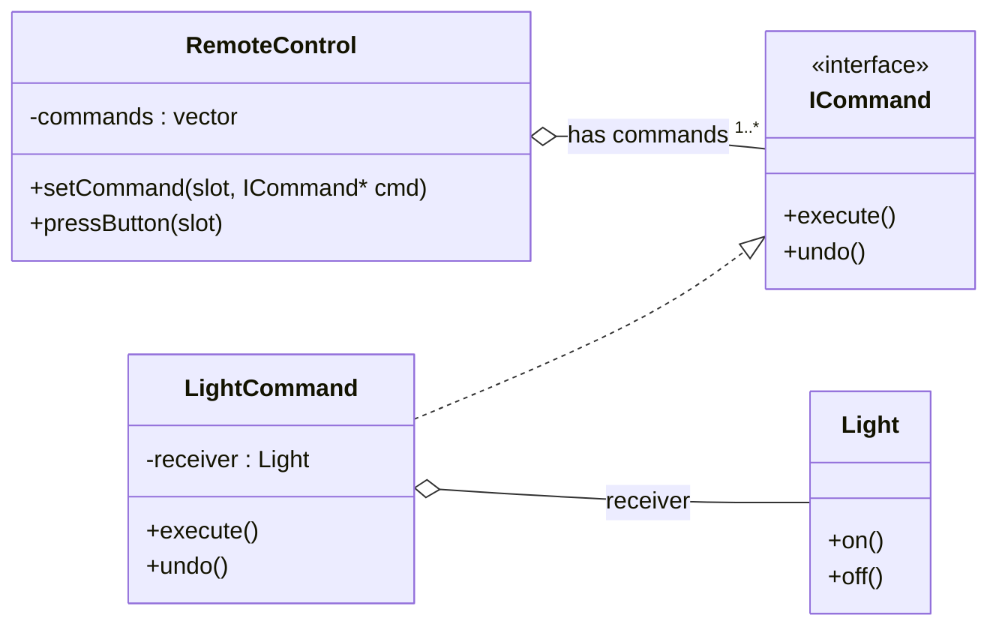

# Command Pattern
The Command pattern encapsulates a request as an object, allowing clients to be parameterized with different requests, queue or log requests, and support undoable operations.

## Smart Home Example
Consider a Smart Home Appliance System.
- We have a remote that has three buttons for fan, light, and AC.
- A default design might build a `Remote` class that holds references to appliances and exposes methods like `PressLightButton`, `PressFanButton`, `PressACButton`.
- Each button method would directly call `on`/`off` on the target appliance.

## Problems With The Default Approach
- Tightly couples the `Remote` class to concrete appliances.
- Changing button behavior requires changing `Remote` code.
- Violates the Open/Closed Principle (OCP).

## Command-Based Solution
To solve this, use the Command pattern with one button and one appliance first.
- Create a `ICommand` interface with an `execute` method (and optionally `undo`).
- Create separate concrete classes for each command.
- Have an appliance class `Light` with methods `on` and `off`.
- Design so the `Remote` does not directly call `Light.on()` or `Light.off()`.
- Instead, `Remote` calls `command.execute()` on a command object it holds.

### LightCommand
- `LightCommand` holds a reference to a `Light` receiver.
- It overrides `execute()` from `ICommand`.
- Inside `execute()`, it calls the appropriate `Light` method (`on` or `off`).
- All commands are linked to their concrete appliance receiver.

So, the `Remote` delegates execution to command objects.

## UML Diagram

