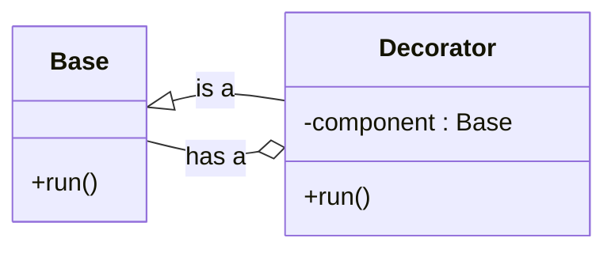
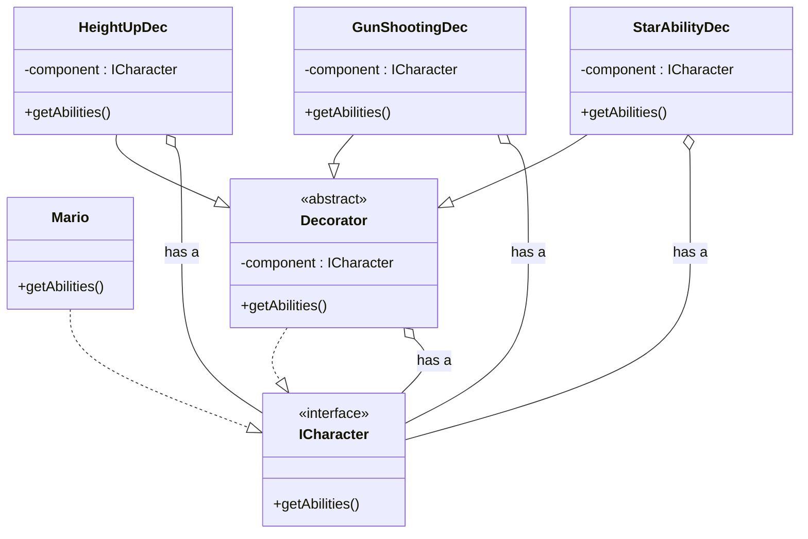

# Decorator Pattern
Decorator pattern attaches additional responsibilities to objects dynamically. Decorators provide a flexible alternative to subclassing for extending functionality.

## Motivation
Let's say we have an object and we tell it to do something. In return, it simply replies that it did something.

Here, the requirement arises that we want to add more functionality to this object. Whenever we tell this object to do something, we want it to do that `something` and, in addition, it is supposed to do `something else` also.

So, one can say this can easily be done by inheriting the object and adding the new functionality to it. At runtime, we can simply create an instance of the class and call the method.

## Inheritance Example
So let's take an example of a base class with `run` method. And we have a child class which inherits the base class and overrides the `run` method. So the UML for this will look like this.

```mermaid
classDiagram
    class Base {
        +run(){
          print("I am running")
        }
    }
    class Child {
        +run(){
          override print("I am running with skates")
        }
    }
    Base <|-- Child
```
### Example Calls
```c++
Base* b = new Base();
b->run();
```
Then we will get the output as -> I am running

```c++
Base* b = new Child();
b->run();
```
Then we will get the output as -> `I am running with skates` because the run method for the child class overrides the `run` method for the base class.

So from the above method we added the new functionality to the base class by simply inheriting it and adding the new functionality to it. And this can be easily decided at runtime.

## Why Decorator Pattern?
If this method exists, then why is there a need for the decorator pattern?
- Inheritance is bad because it creates complex hierarchies and class explosion.

## Mario Example
So to understand the decorator pattern, let's take an example of a game that is Mario.
When Mario starts the game, it has no powers, just a single object. But as the game progresses, it gets some power-ups like `HeightUp`, `GunShooting`, `StarAbility`. These power-ups are simple features that we can add to the Mario object during runtime.

So here, if we try to design the Mario game with inheritance, we will end up with a complex hierarchy because we have to create many child classes like:
 - Mario with HeightUp
 - Mario with GunShooting
 - Mario with StarAbility
 - Mario with HeightUp and GunShooting
 - Mario with HeightUp and StarAbility
- and so on with all the permutations. And if we want to add another feature like flying, then we have to add all the combinations as child classes, which will make the whole hierarchy very complex.

## How Decorator Solves It
- The client calls the decorator, and the decorator under the hood calls the base class method. When the base class method returns, the decorator adds its own functionality to it and returns the result to the client.
- Similarly, there can be multiple decorator layers, for example:
  - Mario with HeightUp and GunShooting and StarAbility would be implemented as:
    - First, it calls the decorator for `HeightUp`.
    - Then, it calls the decorator for `GunShooting`.
    - Then, it calls the decorator for `StarAbility`.
    - Then, it calls the `Mario` object to get the base properties.
    - On returning, all these properties get added to the base, making it a Mario with `HeightUp`, `GunShooting`, and `StarAbility`.
    - And finally, it returns this object to the client.

It somewhere looks like recursion with backtracking, where multiple calls are made one after another, and while coming back, it adds the new functionality to the base function's result.

## Relationships
So what is the relation between the decorator and the base class?
- The decorator has an `is a` relation with the base class to behave like the base class.
- But it uses a `has a` relation with the base class to add new functionality to it.

## UML Diagram


### Notes
- Use of `has a` relation:
  - Here we are keeping the reference of the base class object in the decorator class so that we can call the base class method and add new functionality to it.
- Use of `is a` relation:
  - `is a` relation allows us to override the `run` method of the base class.

## Full Mario UML
So now let's create the UML of the whole Mario game:


### Explanation
- We have created an interface `ICharacter` which has a method `getAbilities()`.
- We have created a class `Mario` which implements the `ICharacter` interface.
- We have created an abstract class `Decorator` which also implements the `ICharacter` interface with both `is a` and `has a` relation.
- We have created three decorator classes `HeightUpDec`, `GunShootingDec`, `StarAbilityDec` which extend the `Decorator` class.
- When `HeightUpDec` is used, it wraps a character object such as `Mario`, like `ICharacter* ch = new HeightUpDec(new Mario());`.
- And now if we call `ch->getAbilities()` it will first call the `getAbilities()` method of the `HeightUpDec` class.
- And in this method, it will first call the `getAbilities()` method of the `Mario` class.
- And then it will add the new functionality of `HeightUp` to it.
- And finally, it will return the result.

Here in this design, we can clearly see we can add multiple decorator layers, and each layer will add its own functionality to the base class without using complex inheritance. If we want to add a new feature like flying, then we just need to create a new decorator class `FlyingDec` which extends the `Decorator` class. And we can add this feature to any of the existing decorator layers.


