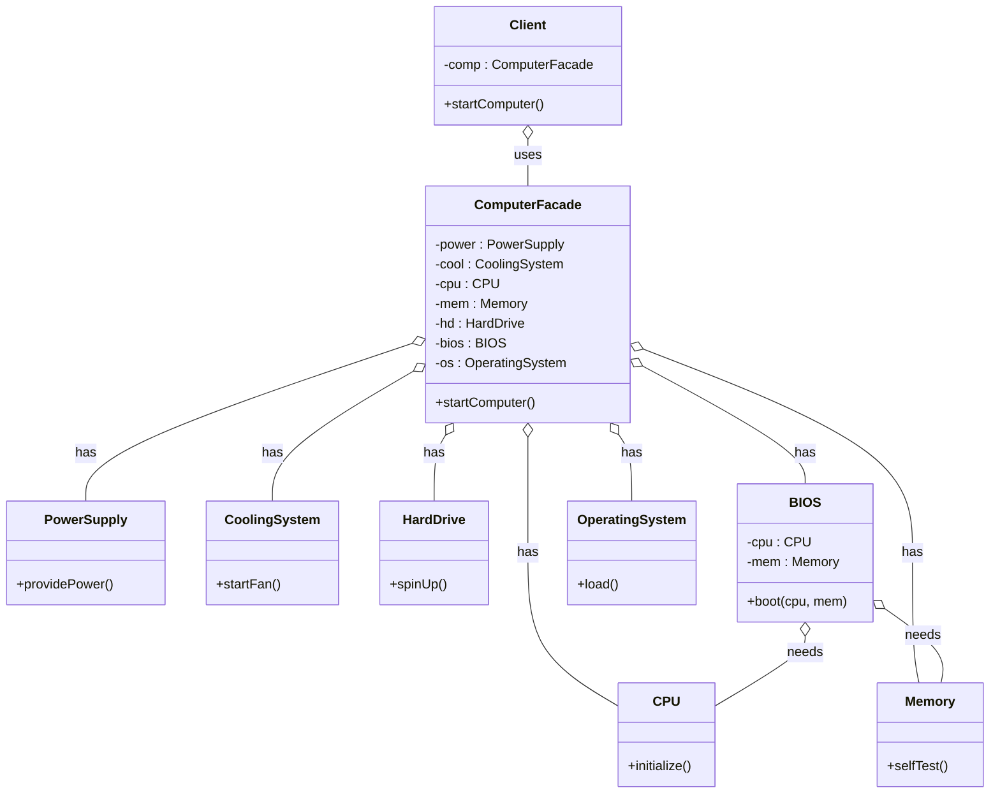

# Facade Pattern
The Facade pattern provides a simplified, unified interface to a complex system of classes. It hides the complexity and exposes only the necessary methods to the client.

## Overview
Let's take a scenario where we have a complex system of classes and the client wants to interact with this system.
Instead of the client directly calling methods of these classes, we create a `Facade` class that offers simple methods and delegates to the subsystem.
This also decouples the client from the complex system of classes. If the system needs to change, we will only change the facade class; no updates are needed in the client code.

## Windows Example
Let's take an example of our computer system.
When we turn on our computer, we don't need to know how the memory starts, how the CPU starts, or how the graphics card starts.
All we need to do is press the power button.
So we can create a facade class with a method `turnOnComputer()`.
This method will call methods of the memory, CPU, and graphics card classes to start the system.
In the client, we simply keep an instance of the facade and call its `turnOnComputer()` method without worrying about how it interacts with the complex subsystem.

The following UML shows the Facade pattern.

## UML Diagram

## Principle of Least Knowledge (Law of Demeter)
This principle states that a class should only talk to its immediate friends and avoid interactions with strangers.
This introduces loose coupling, making the system more maintainable.

Consider three classes: `A`, `B`, and `C`.
`A` is related to `B`, and `B` is related to `C`.
In this case, class `A` should talk only to class `B`, and `B` should talk only to `C`.
Class `A` should not directly talk to class `C`.

### Points to Remember
There are four ways `A` may call methods while respecting the principle:
- `A` can call its own methods.
- `A` can call methods on `B` if `A` has a `has-a` relation with `B`.
- `A` can call methods on `B` if `B` is passed as a parameter to an `A` method.
- `A` can call methods on `C` if `C` is created inside an `A` method (local creation).

## Facade vs Adapter
- Facade provides a simplified interface to a complex subsystem and hides internal complexity.
- Adapter converts the interface of a class to one the client expects; it doesn’t hide a subsystem, it makes an incompatible interface compatible.
