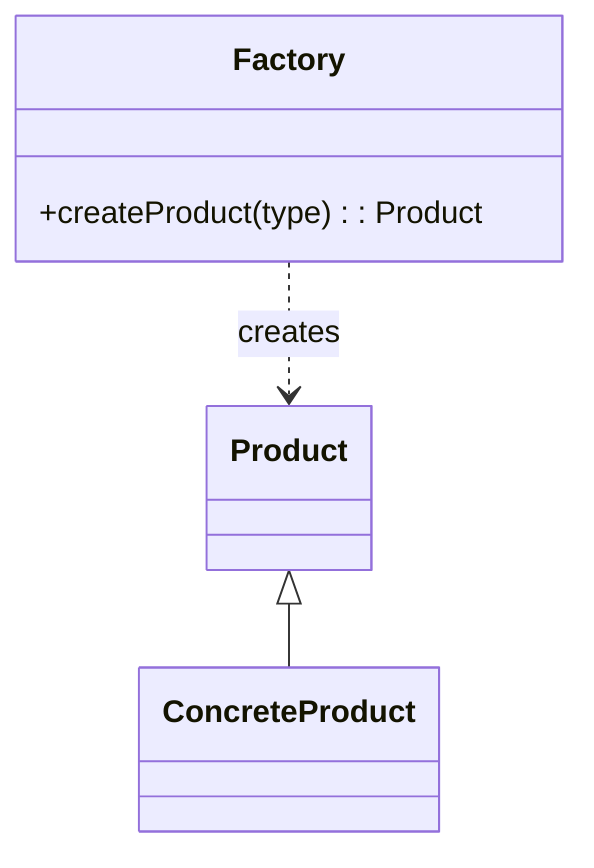

# Simple Factory

## Overview
Let's start with Simple Factory.

## Definition
It is not a formal design pattern; rather, we can treat it as a design practice.

A simple factory class decides which concrete class to instantiate.

So here we are taking an example of Burger — we have a `Burger` class (abstract) with three child classes: `Basic Burger`, `Standard Burger`, and `Premium Burger`.

## Problem
- Let's assume we want a `Standard Burger`. If we create the object from first principles, one might write `Burger* orderedBurger = new StandardBurger();`. This line in client code tightly couples the client to a concrete class.

## Implementation
To rectify this, we can create a factory class called `BurgerFactory` with a method `createBurger(type)`. This method can take values like `Basic`, `Standard`, or `Premium`, and based on the type it will create the object and return it to the client.
 
## UML Diagram — Burger
 
 ```mermaid
 classDiagram
     class Burger {
         +prepare()
     }
 
     Burger <|-- BasicBurger
     Burger <|-- StandardBurger
     Burger <|-- PremiumBurger
 
     class BasicBurger {
         +prepare()
     }
     class StandardBurger {
         +prepare()
     }
     class PremiumBurger {
         +prepare()
     }
 
     class BurgerFactory {
         +createBurger(type): Burger
     }
 
     BurgerFactory ..> Burger : creates
```

## UML Diagram — General


