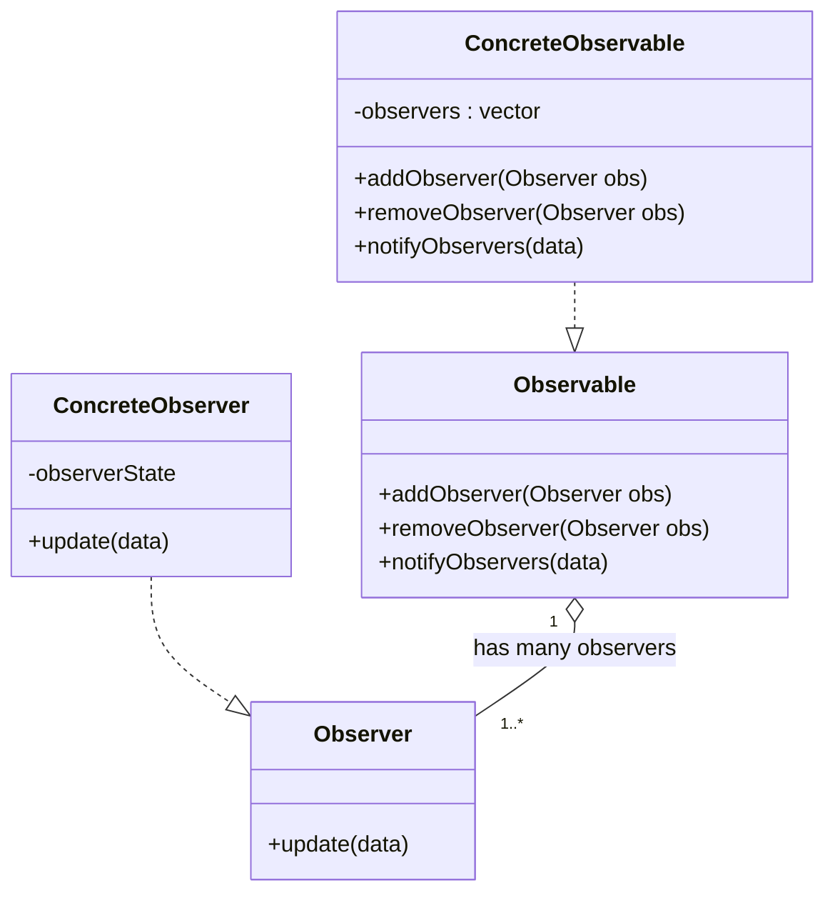

# Observer Design Pattern
What is the Observer design pattern?
It defines a one-to-many relationship between objects such that when one object changes its state, all of its dependents are notified and updated automatically.
Take an example of a YouTube channel where we have a channel and many subscribers. These subscribers act as observers, and the channel is an observable.
So it is a one-to-many relationship, as there can be many observers for one observable.

## Polling vs Push Model
Consider a polling system.
In polling, the observer keeps checking the observable for any change.
But this method is not efficient, as the observer keeps checking the observable even when there is no change.

There is another method called the push model.
In this method, the observable pushes the change to the observer.
This is more efficient than polling, as the observer only gets the change when there is a change.

Within the Observer pattern, two data-delivery styles exist:
- Push: the subject calls `update(data)` and passes the data to observers.
- Pull: the subject calls `update(subject)` and observers query the subject for the data they need.

## Implementation Overview
To implement this design pattern, we will first create an abstract class for `Observable`—something that can be observed.
Another abstract class will be for `Observer`—who will observe the observable.
And the observable will have a one-to-many relationship with the observer.

Following virtual methods will be there in the `Observable` class:
- `addObserver` → used to add the observer to a list of observers
- `removeObserver` → used to remove the observer from the list of observers
- `notifyObservers` (often called `notify`) → loops through all observers and notifies them about the change

Following virtual methods will be there in the `Observer` class:
- `update` → called by the observable to notify the observer about the change. This means it will update itself with “updates” provided by the observable.

## Concrete Classes
Now the concrete class of both abstract classes has to be defined:
- `ConcreteObservable` → implements the abstract methods of the observable class
- `ConcreteObserver` → implements the abstract methods of the observer class

### ConcreteObservable
- It will have a list of observers → `vector<Observer*> observers`
- `addObserver` → takes an observer in the parameter and adds it to the list
- `removeObserver` → takes an observer in the parameter and removes it from the list
- `notifyObservers` → loops through all the observers and calls the `update` method of each observer with the updates provided by the observable.

### ConcreteObserver
- `update` → this method will be called by the `notify` method of the observable class.

Does the observer need to store a reference to the observable?
Not required. The observer does not need to keep a reference to the observable as long as the observable provides all necessary data directly in the `update` call (push model). However, many implementations keep a subject reference to allow deregistration, identify which subject fired the update, or pull additional state when using the pull variant.

## UML Diagram

## YouTube Example
- Here we have channels which act as observables.
  - The channel will have the following members/methods:
    - `string titleOfLatestVideo`
    - `vector<subscriber*> subscribers`
    - `subscribe(subscriber*)`
    - `unsubscribe(subscriber*)`
    - `notifySubscribers(string videoTitle)`
- There will be subscribers for these channels that act as observers.
  - The subscriber will have the following method:
    - `update(string videoTitle)`

This example models the push variant (the channel pushes the `videoTitle` to subscribers).

### Point to Note
This design pattern often violates SRP because we are handling many functions inside the channel’s concrete class, such as subscribing, unsubscribing, and notifying.

We have to make a trade-off: either keep the design simple or strictly follow SRP. Here, we are choosing the simpler approach.

