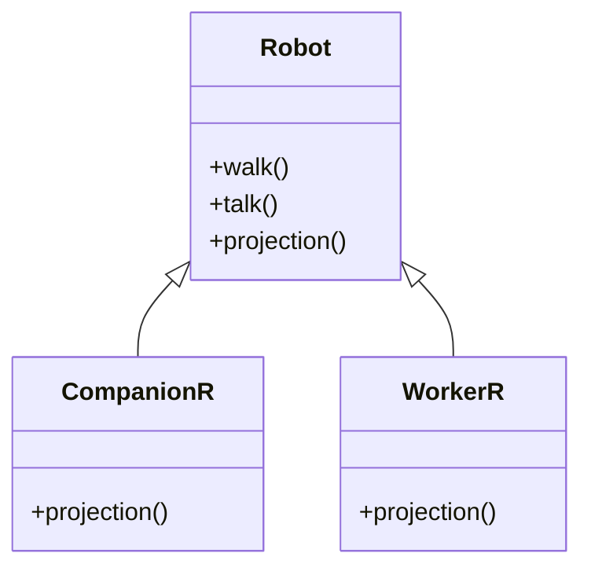
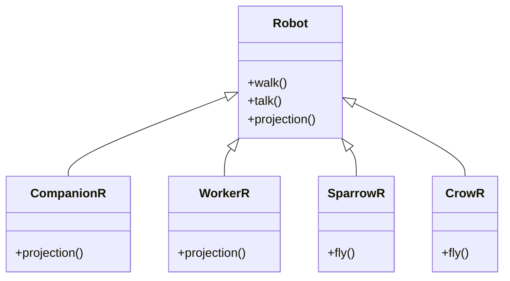
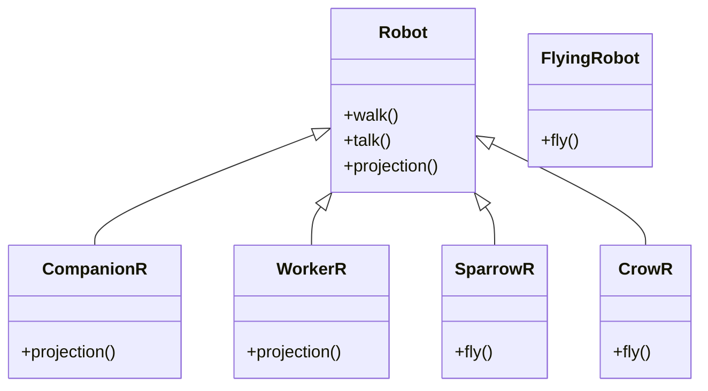
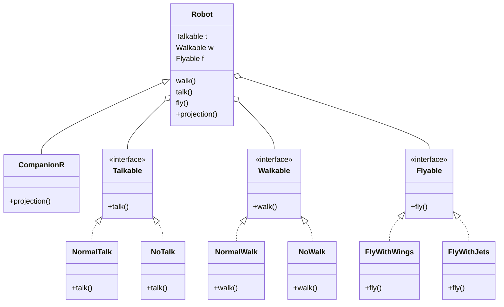
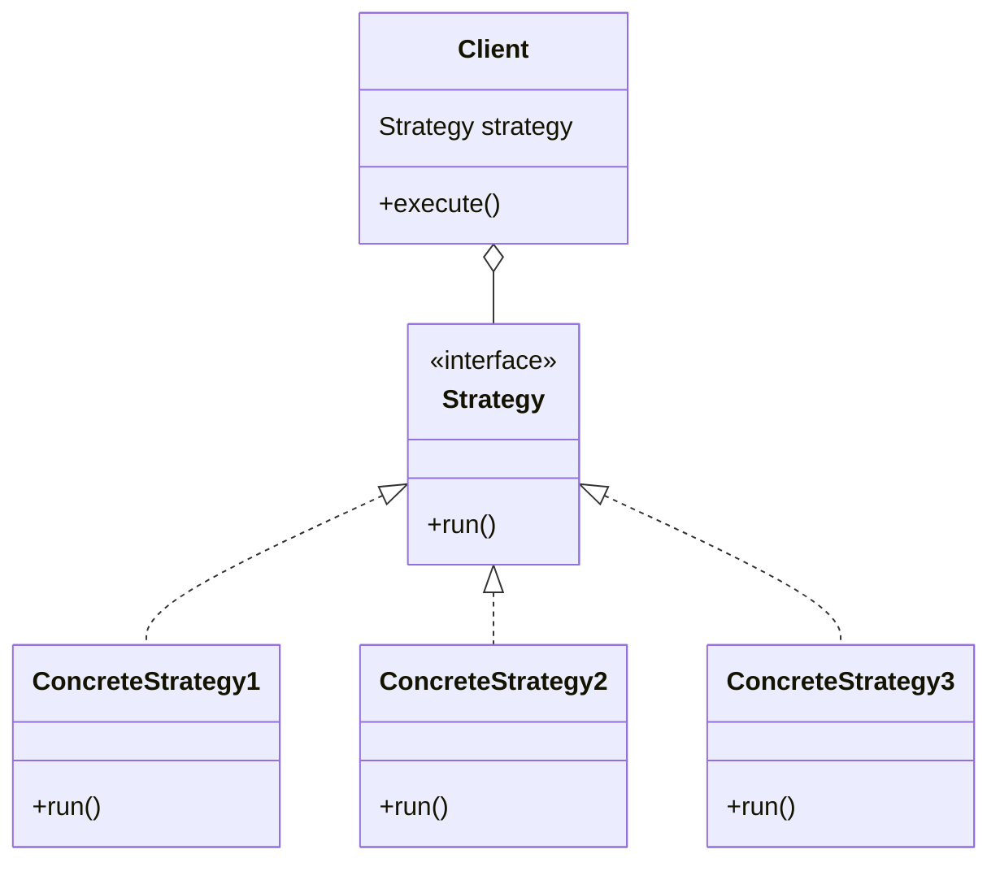

# Strategy Design Pattern

## Robot Example
Now let's take an example of a robot:
Here we will see how inheritance can make the code complex and less maintainable.
We have a Robot class which has two methods `talk()` and `walk()` and a virtual method `projection()` (tells how the robot looks). And there are two types of robots:
- Companion Robot
- Worker Robot

Following is the UML diagram for it:

### UML Diagram



Now let's say we have a third type of robot named Sparrow Robot.
Sparrow Robot is a robot type that can fly.
But the parent class does not have any `fly()` method. So we have to add a new method `fly()` in the Sparrow Robot class itself.
But what if a new robot comes like Crow Robot that can fly too? Here also we have to add the `fly()` method, which will be the same as `fly()` of Sparrow Robot.
Here we can clearly see that we are repeating the code for the `fly()` method which violates the DRY principle.

Following is the UML diagram for it:



So to solve this one can easily think of using further inheritance.
We can create a new class `FlyableRobot` which will have the `fly()` method declared which will be used by the child.
And then Sparrow Robot and Crow Robot can inherit from this `FlyingRobot` class.

Following is the UML diagram for it:



In this we see that we are moving inside a loop of inheritance.
What if a new robot can fly but in a different way using jets?
So here we have to create two child classes under the `Flyable` class as `FlyWithWings` and `FlyWithJets`.
Then the new robot that can fly using jets can inherit from this `JetFlyingRobot` class and the robot which can fly with wings can inherit from the `FlyWithWings` class.

So if we implement interfaces this way, then all the permutations of the robot types will be there, which will be very complicated.

So here the solution comes in the form of a Pattern called Strategy Design Pattern.
What is Strategy Pattern?
This pattern is used when we have multiple ways to do the same task. The Strategy pattern allows us to add new strategies without changing the existing code or to switch between them.

It defines a family of algorithms, puts them in separate classes so that they can be changed at runtime.

So now we will have a class called `Robot`, and it will have only one method called `projection()` which will be implemented by the child classes.
And we will have separate interfaces/abstract classes for `Talkable`, `Walkable`, and `Flyable`.
Each of these interfaces will have concrete child classes like `NormalTalk` and `NoTalk`, `NormalWalk` and `NoWalk`, `FlyWithWings` and `FlyWithJets`.


Another example we can consider is an e‑commerce app:
The payment gateway of an e‑commerce app can have multiple payment methods such as:
- COD
- Credit Card
- Debit Card
- Net Banking
So if we want to add a new payment method like UPI, this pattern allows us to add the payment method without hampering the main checkout flow.
 
### Strategy UML



So in the diagram we can clearly see that we have kept the references of all three interfaces in the `Robot` class. And this `Robot` class has a composition relationship with all three interfaces.
So now we can easily change the behavior of the robot by changing the reference of the interface.
While creating a robot we can define the behavior of the robot by passing the reference of the interface during runtime.
All the methods in the `Robot` class have one thing to do: delegate the call to the respective interface method.

So in the main class we create a robot object like:
```cpp
Robot r = new CompanionR(
  new NormalTalk(), 
  new NormalWalk(), 
  new FlyWithWings()
);
```

This design clearly solves our problem of complex inheritance.
If in the future we want a class called `NonFlyingRobot`, then we can easily create a class `NonFlyingRobot` which will be inheriting the `Flyable` class.
So we can see here we don't have to change the existing code—neither the `Robot` class nor the `Flyable` class.
So automatically the Open/Closed Principle (OCP) is also getting followed here.

So finally the UML of a Strategy design pattern looks like:

### Strategy Pattern (Generic UML)



