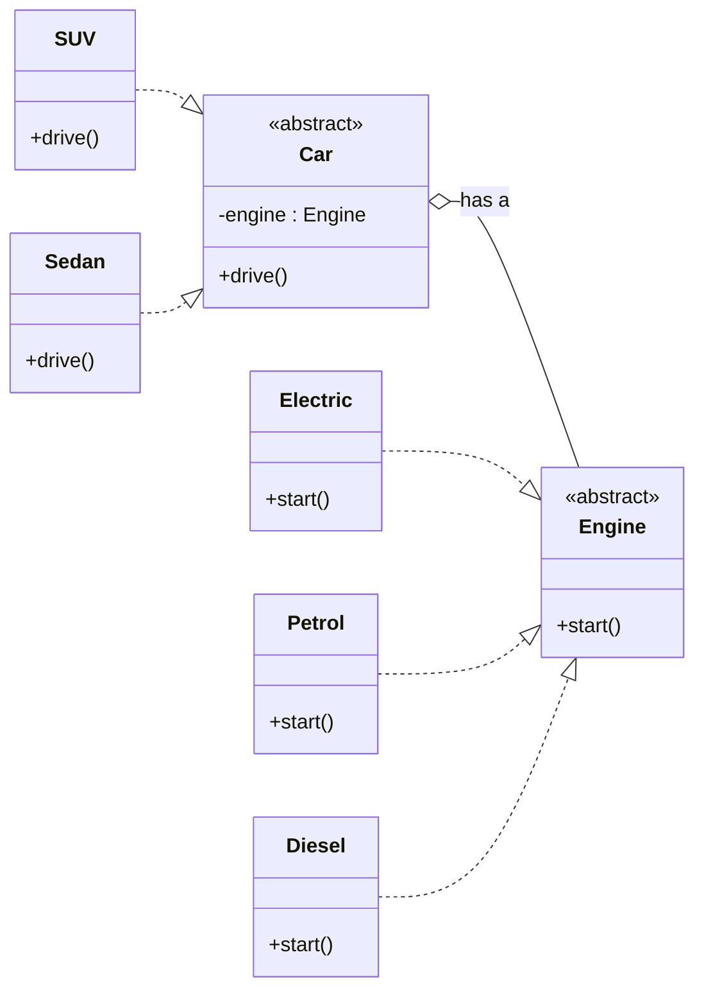
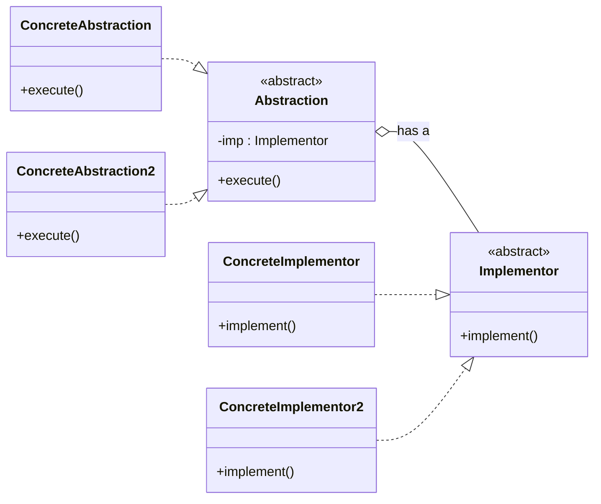

# Bridge Pattern
## Overview
Bridge decouples the abstraction (HLP) from its implementation (LLP) so that both can vary independently.

## Car–Engine Example
- Car types (m): Sedan, Hatchback, SUV
- Engine types (n): Petrol, Diesel, Electric

Combining every car type with every engine type leads to m × n classes, causing class explosion. Examples:
- Sedan with Petrol
- Sedan with Diesel
- Hatchback with Electric

## Split Into Two Parts
- High‑Level Part (Abstraction): `Car` with virtual `drive()`.
- Low‑Level Part (Implementation): `Engine` with virtual `start()`.

Keep HLP and LLP in mind; the terms “abstraction” and “implementation” can be confusing.

## Child Classes
- `Sedan`, `Hatchback`, etc. inherit from `Car`.
- `Petrol`, `Diesel`, etc. inherit from `Engine`.

## Association
- `Car` stores a reference to `Engine`.
- This is a “has a” relation between the abstract classes:

### UML — Bridge Pattern



## Result
- This pattern solves the problem of class explosion.
- We now create m + n classes instead of m × n.

### Example Usage
```cpp
Car* car = new Sedan(new Petrol());
```

So the standard UML of Bridge pattern looks like:
### UML — Standard Bridge




