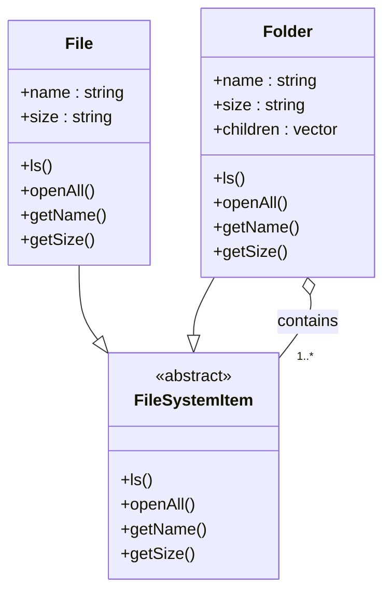

# Composite Pattern
The Composite pattern models a tree structure with composite nodes (folders) and leaf nodes (files). It lets clients treat individual objects and compositions uniformly.

## File System Analogy
A file system is a perfect example:
- Files: leaf nodes; further branching is not possible.
- Folders: composite nodes; can contain files and other folders, forming a hierarchy.

## First-Principles Design
- File: create a class `File` with attributes like `name`, `size`, and operations.
- Folder: create a class `Folder` with attributes like `name`, and child collections such as `vector<File*>`, `vector<Folder*>`, etc.

## Relationships
- A file cannot contain any other files or folders.
- A folder can have multiple files and multiple folders:
  - One‑to‑many composite relation with `File`.
  - One‑to‑many composite relation with `Folder` (itself).

## Operations
- `ls`: list all files and folders in the current folder.
- `openAll`: open all folders inside the current folder (expand the whole hierarchy).

If we simply loop through files and folders for `openAll`, we’ll get files first and folders after, which is not ideal. We want to open all folders first, then the files within them. Use a recursive approach to traverse folders and open their contents until reaching leaf nodes.

## Uniform Treatment
The Composite pattern says to treat both composite and leaf nodes uniformly. We achieve this by giving them a common interface.

## Common Interface
Create an abstract class `FileSystemItem` with methods:
- `ls()`
- `openAll()`
- `getName()`
- `getSize()`

## Concrete Classes
- File:
  - `name : string`
  - `size : string`
  - `ls()` — overridden by `File`
  - `openAll()` — overridden by `File`
  - `getName()`
  - `getSize()`
- Folder:
  - `name : string`
  - `size : string` — sum of all files and folders inside the current folder
  - `items : vector<FileSystemItem*>` — list of files and folders
  - `ls()` — overridden by `Folder`
  - `openAll()` — overridden by `Folder`
  - `getName()`
  - `getSize()`

## Summary of Relations
- `File` is a `FileSystemItem`.
- `Folder` is a `FileSystemItem` and also has a list of `FileSystemItem` (one‑to‑many relationship).

 This can be seen in this UML diagram:

## UML Diagram

## Uses
Any LLD pattern that follows the tree like structure can be implemented using the Composite pattern.

