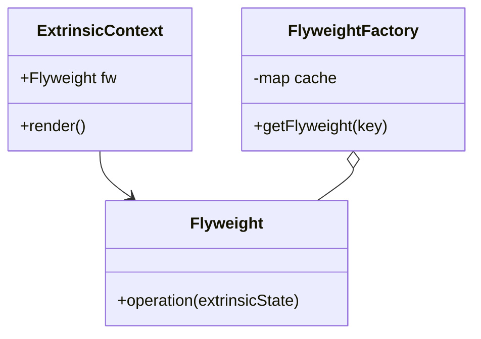

# Flyweight Design Pattern

## Problem Scenario: Space Game

Let's take the example of a **Space Game** where we have to render different types of asteroids on the screen.
Suppose we need to render **1,000,000 asteroids**.

If we create 1 million individual objects, it will be a heavy operation and consume a significant amount of memory.

### The Memory Problem

Let's look at a typical `Asteroid` class:

```cpp
class Asteroid {
    int length;
    int width;
    int height;
    string color;
    string texture;
    int positionX;
    int positionY;
    int velocityX;
    int velocityY;
};
```

Each variable takes up memory space. When we sum this up for 1 million objects, the total memory footprint becomes huge and potentially unfeasible.

---

## Solution: The Flyweight Pattern

The Flyweight Pattern suggests using **sharing** to support large numbers of fine-grained objects efficiently. To achieve this, we break the class into two parts:

1.  **Intrinsic Properties**: State that is shared and does not change often.
2.  **Extrinsic Properties**: State that is unique to each object and changes constantly.

### 1. Intrinsic Properties (Shared)

We can extract the common properties into a class called `AsteroidFlyweight`. These properties are constant for a given "type" of asteroid and can be reused.

For example, we might only have 3 types of asteroid designs:

- **Dimensions**: `[10, 20, 30]`
- **Color**: `[red, green, blue]`
- **Texture**: `[rock, metal, ice]`

### 2. Extrinsic Properties (Unique context)

The extrinsic properties are the ones that change per instance and cannot be reused. These must be stored by the client or passed into the flyweight methods.

- `positionX`
- `positionY`
- `velocityX`
- `velocityY`

### How It Works

Instead of creating 1 million full objects, we create:

1.  **A few `AsteroidFlyweight` objects**: e.g., only 3 objects representing the 3 unique types (Red Rock, Green Metal, Blue Ice).
2.  **1,000,000 `AsteroidContext` objects**: These are lightweight and only hold the extrinsic state (position) and a reference to the shared `AsteroidFlyweight`.

If we didn't do this, we would end up creating duplicate data for hundreds of thousands of identical asteroids. By sharing, we drastically reduce memory usage.

---

## Implementation Details

### AsteroidContext

The `AsteroidContext` (client-side object) will hold a reference to the `AsteroidFlyweight` class along with its position data.

### Flyweight Factory

To ensure we reuse existing flyweights, we use a **Factory** class.

- The factory maintains a **Map** (cache) of existing flyweights.
- **Key**: A unique identifier for the state, e.g., `length_10_color_red_texture_rock`.
- **Value**: The actual `AsteroidFlyweight` object.

**Logic:**
When a client requests an asteroid type:

1.  Check the map.
2.  If the key exists, return the existing `AsteroidFlyweight`.
3.  If not, create a new one, store it in the map, and return it.

---

## Standard UML


