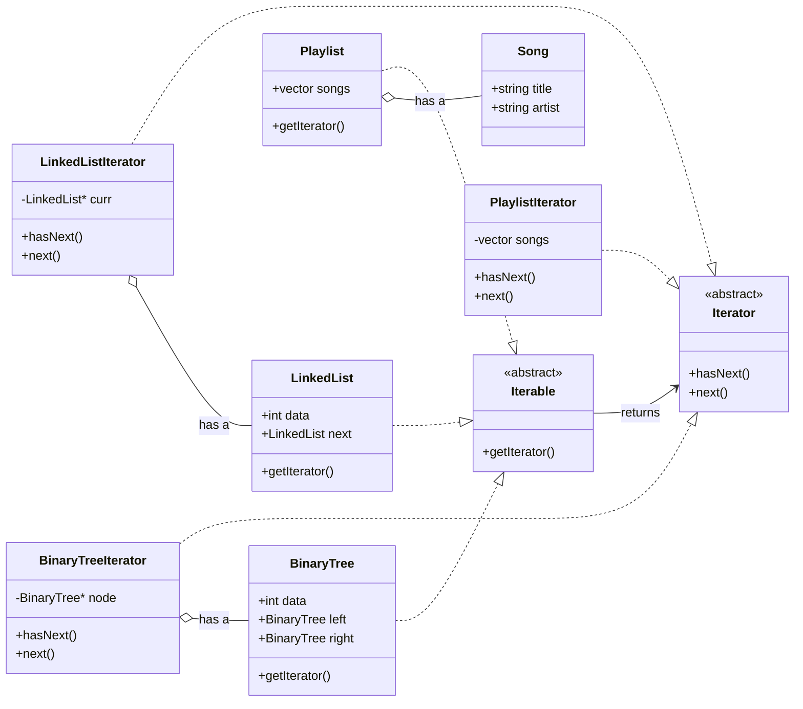
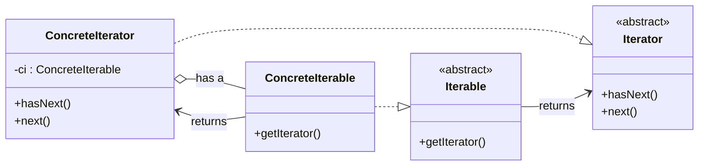

# Iterator Pattern
Iterator pattern provides a way to access the elements of an aggregate object sequentially without exposing its underlying representation.
## Overview
Let’s take an example of a playlist in a music app. There we have a list of songs in the playlist, and to play them we need to iterate over those songs. If the songs are stored in a `vector`, we can use a `for` loop to iterate over the vector and play the songs.

If we change the playlist data structure to a linked list, then for loop will not work so we would need to change the client code. Implementing the iterator for a linked list forces changes in the client’s iteration logic. This mixes storage and traversal concerns and clearly breaks SRP.

To follow SRP, the playlist class should call methods that provide the next song to play without knowing the underlying data structure. So we create a separate iterator class. Doing this allows the playlist class to get the next song of the playlist without knowing how the data is stored. All the methods in the playlist class like `getSongById`, `getSongByIndex`, `addSong`, `removeSong`, etc. can use the iterator. The type of the iterator can be chosen at runtime, and there is no need to change the code in playlist methods like `getNextSong` and `getPreviousSong`.

## Understanding the Pattern
- We have three types of data structures that need to be iterated:
  1. Linked List
  2. Binary Tree
  3. Playlist

### Interfaces
- First, create an `Iterator` interface with two methods:
  - `next()` — returns the next element of the data structure
  - `hasNext()` — returns whether there is a next element
- Then create an `Iterable` interface with a virtual method `getIterator()`.
- This `Iterable` class has a “has a” relationship with the `Iterator` class.
- So we can say, `koi bhi Iterable hme Iterator laake dega`, which will contain the logic for the iteration.

### Data Structures as Iterable
- LinkedList — has `int data`, `LinkedList next` (returns the next node of the linked list), and `getIterator()` (returns the iteration logic for the linked list)
- BinaryTree — has `int data`, `BinaryTree left`, `BinaryTree right`, and `getIterator()` (overridden by the binary tree class to return the iteration logic for the binary tree)
- Playlist — has `int data`, `Playlist next`, and `getIterator()` (returns the iteration logic for the playlist)

### Concrete Iterators
- LinkedListIterator — overrides `next()` and `hasNext()`. It has a reference to the `LinkedList` class like `LinkedList currentNode` (the current node is stored and used to iterate over the linked list).

#### Gist: `hasNext()`
- Check whether the current node (stored as a reference in the iterator class) is `null` or not.
- If it is `null`, return `false`.
- If it is not `null`, return `true`.

#### Gist: `next()`
- Check whether the current node (stored as a reference in the iterator class) is `null` or not.
- If it is `null`, throw an exception.
- If it is not `null`, update the `currentNode` pointer to the next node and return the `currentNode` data.

- Similarly, we can create the iterator for the binary tree:
  - BinaryTreeIterator — overrides `next()` and `hasNext()`. It has a reference to the `BinaryTree` class like `BinaryTree currentNode` (the current node is stored and used to iterate over the binary tree).
### UML — Iterator Pattern

### UML — Standard Iterator

