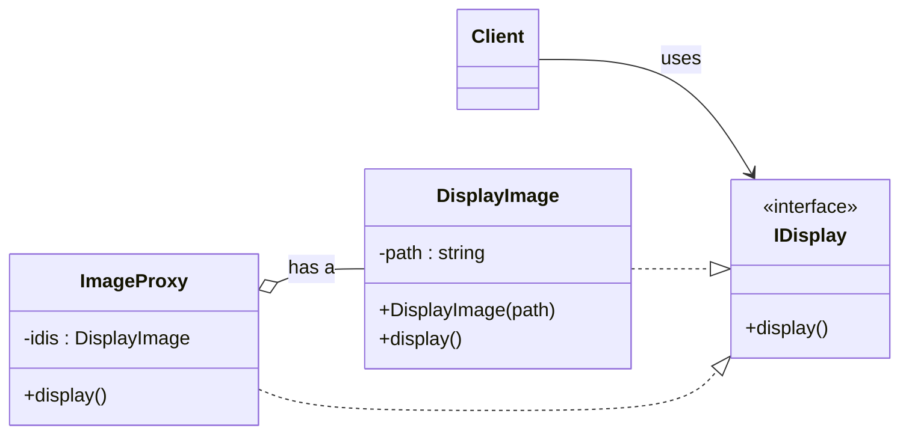
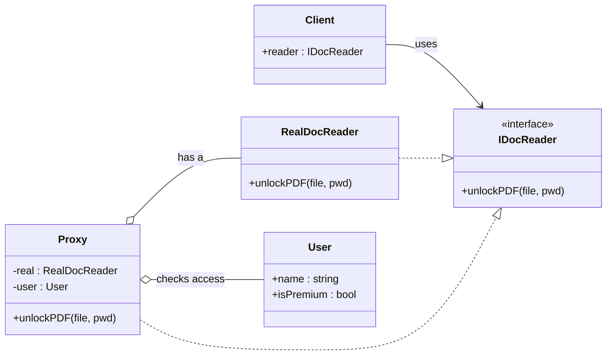
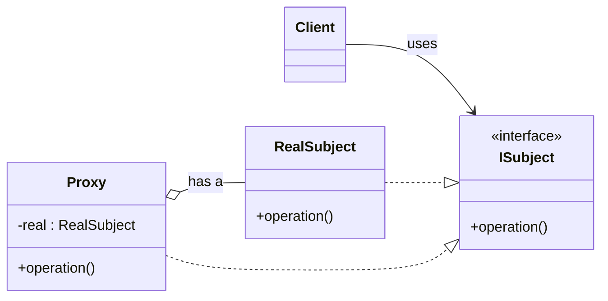

# Proxy Pattern
## Overview
A proxy acts as a middleman between the client and the real subject (server/resource). All client requests go to the proxy, which may perform checks or optimizations before forwarding them to the real subject.
For example, when access requires authorization, the proxy verifies the user first; if not authorized, it blocks the request and prevents hitting the server.
From the client’s point of view, the proxy behaves like the real subject; the client does not need to know whether it talks to the server or the proxy.

Remember: the proxy represents the resource. The client interacts with the proxy, not directly with the resource.

## Types of Proxies
### Virtual Proxy
  The virtual proxy can be explained using an image processor.
  Let’s take a scenario where we have a class `DisplayImage`.
  Its constructor takes the image path as a parameter and creates the object.
  We can design two approaches:
  - Do all image processing (filters, resizing, etc.) in the constructor.
  - Defer processing to a separate `display()` method.
  The second approach is preferable for responsiveness, but heavy processing at call time can still hurt user experience.
  The first approach may waste resources if the client constructs `DisplayImage` but never displays it.
  A proxy solves this by delaying expensive work until it’s actually needed.

  First, create an interface `IDisplay` with a single method `display()`.
  `DisplayImage` implements `IDisplay`.
  Then create a proxy `ImageProxy` that:
  - has a `has-a` relation with `DisplayImage` (holds a reference),
  - has an `is-a` relation with `IDisplay` (implements the same interface).
  The `ImageProxy` constructor leaves the `DisplayImage` pointer null.
  When the client calls `display()`, the proxy lazily creates `DisplayImage` if needed and forwards the call.
  The client just uses `IDisplay`; it doesn’t care whether the request goes to the proxy or the real subject.
  Let's implement the proxy's `display()` method:
  ```c++
  void display() override
  {
    if (idis == nullptr)
    {
      idis = new DisplayImage(imagePath);
    }
    idis->display();
  }
  ```
  With this implementation, the client constructs a proxy, for example:
  `IDisplay* dis = new ImageProxy(imagePath);`.
  The proxy initializes its internal pointer to `nullptr`.
  When the client later calls `dis->display()`, the proxy performs the heavy work by creating the `DisplayImage` and then delegates to `display()`.

  This protects user experience: heavy work happens only when display is requested.
  ### UML — Virtual Proxy



### Protection Proxy
  Consider a document reader where unlocking a PDF is a premium feature.
  - Define an abstract class `IDocReader` with `unlockPDF(file, password)`.
  - Implement `RealDocReader` as the concrete reader.
  - Create a proxy that implements `IDocReader` and holds a `RealDocReader`.
  The proxy also holds a `User` reference and, on `unlockPDF`, checks whether the user is premium:
  - If premium, it delegates to `RealDocReader.unlockPDF(...)`.
  - Otherwise, it rejects the request (e.g., by throwing an exception).
 
 Purpose:
 - Protect sensitive operations from unauthorized access.
 - In this case, protect `RealDocReader.unlockPDF(...)`.
 - Non‑premium users cannot unlock the document.
 - This keeps the server safe from unauthorized requests.

### UML — Protection Proxy


### Remote Proxy
  Used when connecting to a remote server.
  The proxy acts as an intermediary: the client calls the proxy, which calls the remote server.
  Connection overhead and details are hidden from the client, and the proxy can perform checks before forwarding.

### Standard Proxy UML



### Notes
- Pass the proxy object to the client so it uses the proxy instead of the real subject.


