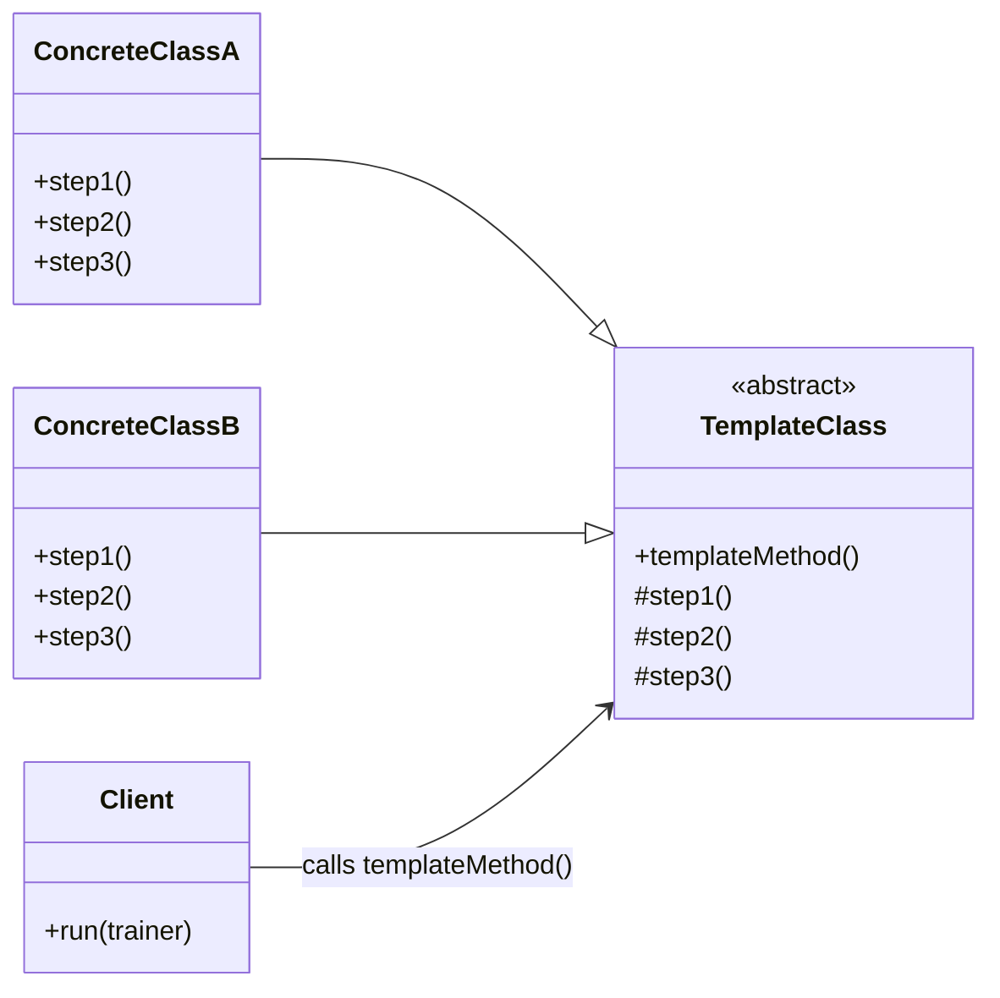

# Template Method Pattern
The Template Method pattern defines the skeleton of an algorithm in a base class and lets subclasses implement individual steps. It guarantees the steps execute in a fixed order while allowing customization.

## Scenario
Consider a data science workflow that uses different tools to process data. Typical steps:
- Load the source data for the specific model
- Preprocess data
- Train the model
- Evaluate the model
- Save the model

We want the algorithm to execute these steps in the same order every time, so future models can reuse the pipeline without breaking it. This is where the Template Method pattern fits.

## Design
Create an abstract class `ModelTrainer` with the following methods:
- `load_data()`
- `preprocess_data()`
- `train_model()`
- `evaluate_model()`
- `save_model()`

Then inherit `ModelTrainer` for specific models, such as:
- `NeuralNetworkModel`
- `DecisionTreeModel`

## Problem
If a subclass overrides the steps freely, it might call `train_model()` before `preprocess_data()`, which breaks the pipeline.

## Solution
Define a `templateMethod()` in `ModelTrainer` that calls the steps in the correct order. Subclasses can override the individual step methods but must not override `templateMethod()`.

## Client
Keep a reference to `ModelTrainer` in the client and call the template method:
```c++
class Client {
  public:
  void run(ModelTrainer* trainer) {
    trainer->templateMethod();
  }
}
```
This ensures the client always triggers the algorithm through `templateMethod()`, preserving the step order.

## UML Diagram


## Most Common Use Cases
- It is used where a definite pipeline of steps is required to be followed by the subclasses.


