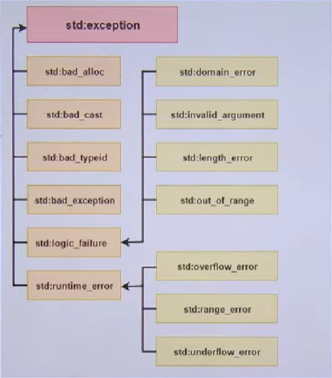

# Exception Handling

## What is an exception?
An exception arises during the execution (runtime) of a program and can cause the program to terminate abruptly with errors.

## Core keywords
- `TRY`: It represents the code block which might throw an exception during execution.
- `CATCH`: It represents the code block that is executed when an exception is thrown from the `try` block.
- `THROW`: This keyword is used to actually throw the exception at runtime.

## Example: Before vs After
Let's take an example where we first deposit $1000 and then withdraw $2000.

<table>
  <thead>
    <tr>
      <th>Before (string exceptions)</th>
      <th>After (typed exceptions)</th>
    </tr>
  </thead>
  <tbody>
    <tr>
      <td>
        <pre><code class="language-cpp">void deposit(int amount){
  balance += amount;
  cout &lt;&lt; "Deposited $" &lt;&lt; amount &lt;&lt; endl;
}
void withdraw(int amount){
  if(amount &gt; balance){
    throw "Insufficient balance";
  } else if(amount &lt; 0) {
    throw "Invalid amount";
    // No code will be executed after the above line
  } else {
    balance -= amount;
    cout &lt;&lt; "Withdrawn $" &lt;&lt; amount &lt;&lt; endl;
  }
}
int main(){
  try{
    deposit(1000);
    // Here we are trying an amount greater than the balance
    withdraw(2000);
    // This line will not be executed; an exception will be thrown with the message "Insufficient balance"
    // and this will get caught in the catch block

    // POINT TO NOTE: After an exception, no code is executed after that line, so the below line will not be executed
    deposit(1000);
  } catch(const char* e){
    // e represents the exception message that is thrown in the method
    cout &lt;&lt; "Exception Occurred: " &lt;&lt; e &lt;&lt; endl;
  }
}</code></pre>
      </td>
      <td>
        <pre><code class="language-cpp">void withdraw(int amount){
  try{
    if(amount &gt; balance){
      throw runtime_error("Insufficient balance");
    } else if(amount &lt; 0) {
      throw invalid_argument("Invalid amount");
    } else {
      balance -= amount;
      cout &lt;&lt; "Withdrawn $" &lt;&lt; amount &lt;&lt; endl;
    }
    // We should define the type of e as the exception class to catch all types of exceptions, as it is the base class for all exceptions
  } catch(const exception &amp;e){
    cout &lt;&lt; "Exception Occurred: " &lt;&lt; e.what() &lt;&lt; endl;
  }
}</code></pre>
      </td>
    </tr>
  </tbody>
</table>

This method of using `if-else` in the methods is not a good way to handle exceptions. There is a better way to do this using `try-catch` blocks in the methods and using the exception classes provided by the language.

## Exception hierarchy
The following image shows the children of the exception class in C++.

## Catch Strategies: Single vs Multiple
<table>
  <thead>
    <tr>
      <th>Single catch (`std::exception`)</th>
      <th>Multiple specific catches</th>
    </tr>
  </thead>
  <tbody>
    <tr>
      <td>
        <pre><code class="language-cpp">void withdraw(int amount){
  try{
    if(amount &gt; balance){
      throw runtime_error("Insufficient balance");
    } else if(amount &lt; 0) {
      throw invalid_argument("Invalid amount");
    } else {
      balance -= amount;
      cout &lt;&lt; "Withdrawn $" &lt;&lt; amount &lt;&lt; endl;
    }
  } catch(const exception &amp;e){
    cout &lt;&lt; "Exception Occurred: " &lt;&lt; e.what() &lt;&lt; endl;
  }
}</code></pre>
      </td>
      <td>
        <pre><code class="language-cpp">void withdraw(int amount){
  try{
    if(amount &gt; balance){
      throw runtime_error("Insufficient balance");
    } else if(amount &lt; 0) {
      throw invalid_argument("Invalid amount");
    } else {
      balance -= amount;
      cout &lt;&lt; "Withdrawn $" &lt;&lt; amount &lt;&lt; endl;
    }
    // Defining different catch blocks for different types of exceptions
  } catch(const runtime_error &amp;e){
    cout &lt;&lt; "Runtime Exception Occurred: " &lt;&lt; e.what() &lt;&lt; endl;
  } catch(const invalid_argument &amp;e){
    cout &lt;&lt; "Invalid Argument Exception Occurred: " &lt;&lt; e.what() &lt;&lt; endl;
    // Defining a catch block for unknown exceptions
  } catch(...) {
    cout &lt;&lt; "Unknown Exception Occurred" &lt;&lt; endl;
  }
}</code></pre>
      </td>
    </tr>
  </tbody>
</table>

Separating exceptions helps the readability of the code. Using `const` in catch blocks ensures the exception object is not modified in the catch block, and `&` is used to avoid copying the exception object.

## Custom Exceptions
Creating custom exception classes can help in better handling of exceptions in our code.

<table>
  <thead>
    <tr>
      <th>Standard exceptions</th>
      <th>Custom `InvalidAmountError`</th>
    </tr>
  </thead>
  <tbody>
    <tr>
      <td>
        <pre><code class="language-cpp">void withdraw(int amount){
  try{
    if(amount &gt; balance){
      throw runtime_error("Insufficient balance");
    } else if(amount &lt; 0) {
      throw invalid_argument("Invalid amount");
    } else {
      balance -= amount;
      cout &lt;&lt; "Withdrawn $" &lt;&lt; amount &lt;&lt; endl;
    }
  } catch(const runtime_error &amp;e){
    cout &lt;&lt; "Runtime Exception Occurred: " &lt;&lt; e.what() &lt;&lt; endl;
  } catch(const invalid_argument &amp;e){
    cout &lt;&lt; "Invalid Argument Exception Occurred: " &lt;&lt; e.what() &lt;&lt; endl;
  } catch(...) {
    cout &lt;&lt; "Unknown Exception Occurred" &lt;&lt; endl;
  }
}</code></pre>
      </td>
      <td>
        <pre><code class="language-cpp">// Inheriting from runtime_error
class InvalidAmountError : public runtime_error {
public:
  // The base class runtime_error is constructed using `msg`
  // When we catch it and call .what(), we get the message
  InvalidAmountError(const string&amp; msg) : runtime_error(msg) {}
};

void withdraw(int amount){
  try{
    if(amount &gt; balance){
      throw InvalidAmountError("Insufficient balance");
    } else if(amount &lt; 0) {
      throw InvalidAmountError("Invalid amount");
    } else {
      balance -= amount;
      cout &lt;&lt; "Withdrawn $" &lt;&lt; amount &lt;&lt; endl;
    }
  } catch(const runtime_error &amp;e){
    cout &lt;&lt; "Runtime Exception Occurred: " &lt;&lt; e.what() &lt;&lt; endl;
  } catch(const InvalidAmountError &amp;e){
    cout &lt;&lt; "Invalid Argument Exception Occurred: " &lt;&lt; e.what() &lt;&lt; endl;
  } catch(...) {
    cout &lt;&lt; "Unknown Exception Occurred" &lt;&lt; endl;
  }
}</code></pre>
      </td>
    </tr>
  </tbody>
</table>