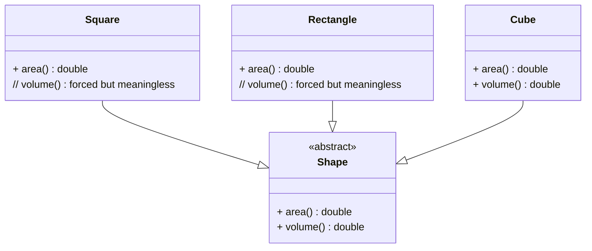

# ISP (Interface Segregation Principle)

- Many client-specific interfaces are better than one general-purpose interface.
- Clients should not be forced to implement methods they do not use.

## Problem Design (violates ISP)
2D shapes are forced to override `volume()` method, which we have to handle by throwing an exception since 2D shapes do not have a volume. In other words it is also violating the `ISP` as well as `LSP`.



## Segregated Interfaces (ISP-compliant)
Separate capabilities so clients implement only what they need.

```mermaid
classDiagram
    interface 2dShape  {
        + area() double
    }
    interface 3dShape {
        + volume() double
    }

    class Square
    class Rectangle
    class Cube

    Square ..|> 2dShape
    Rectangle ..|> 2dShape
    Cube ..|> 3dShape
```

## Takeaways
- Do not bundle unrelated operations into a single interface.
- Provide focused interfaces so implementations are not forced to add dummy or unsupported methods.


