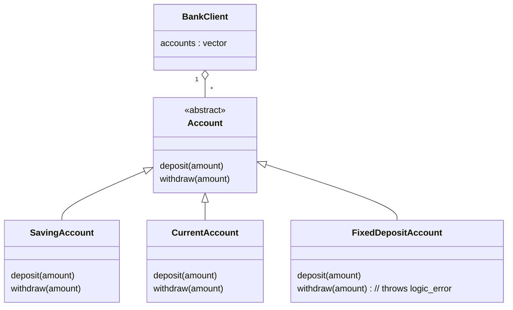
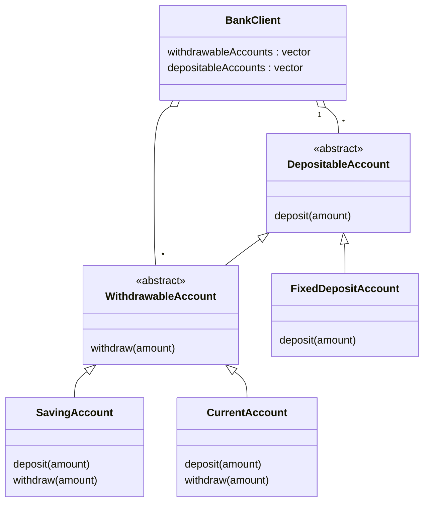

# LSP - Liskov Substitution Principle

## What is LSP?
LSP states that a class should be substitutable for its base class. In other words, we should be able to use a derived class object in place of a base class object without any unexpected behavior. 
`Jaha ham parent class ko bhej sakte hai waha yadi ham child class ko bhej de to koi dikkat nhi hona chahiye`

## Scenario
- Lets say we have a `Account` class which is a abstract class containing `deposit()` and `withdraw()` method.
- And we have a `SavingsAccount` and `CurrentAccount` class inheriting from `Account`.
- Now in future lets say we will add a `FixedDepositAccount` class also inheriting from `Account`.
- And this `FixedDepositAccount` class will have `deposit()` method but the `withdraw()` method should throw an exception(as it is not possible to withdraw from a fixed deposit account).
- So while using `Account` class reference we should not be able to withdraw from a fixed deposit account.
- So here we can say substituting the `FixedDepositAccount`(child class object) for `Account` (base class object) is not feasible.
- Because `FixedDepositAccount` has a different behavior for `withdraw()` method.
- So here we can say that `FixedDepositAccount` violates LSP.

### Buggy Alternative Solution
- So one can easily tell lets simply apply a condition in the client code to check if the account is a fixed deposit account or not like:

```c++
if(accountType != "FixedDepositAccount"){
  //Only Deposits allowed
  deposit();
}else{
  //For savings and current account both are allowed
  deposit();
  withdraw();
}
```
Issue:
- If we apply this condition in the client code then we will have to change the client code every time we add a new account type in future.
- This is not a good solution and clearly violates OCP(class should be open for extension but closed for modification and here we clearly modify the client code).
- So this is a bad way to handle this


## UML Diagram (Before)


## Refactoring for LSP
- Create an abstract base class `NonWithdrawableAccount` that contains `deposit()` method only.
- Create an abstract class `WithdrawableAccount` that extends `NonWithdrawableAccount` and it contains `withdraw()` method.
- `SavingsAccount` and `CurrentAccount` inherit from `WithdrawableAccount` supporting both operations.
- `FixedDepositAccount` inherits directly from `NonWithdrawableAccount`.


## UML Diagram (After)
