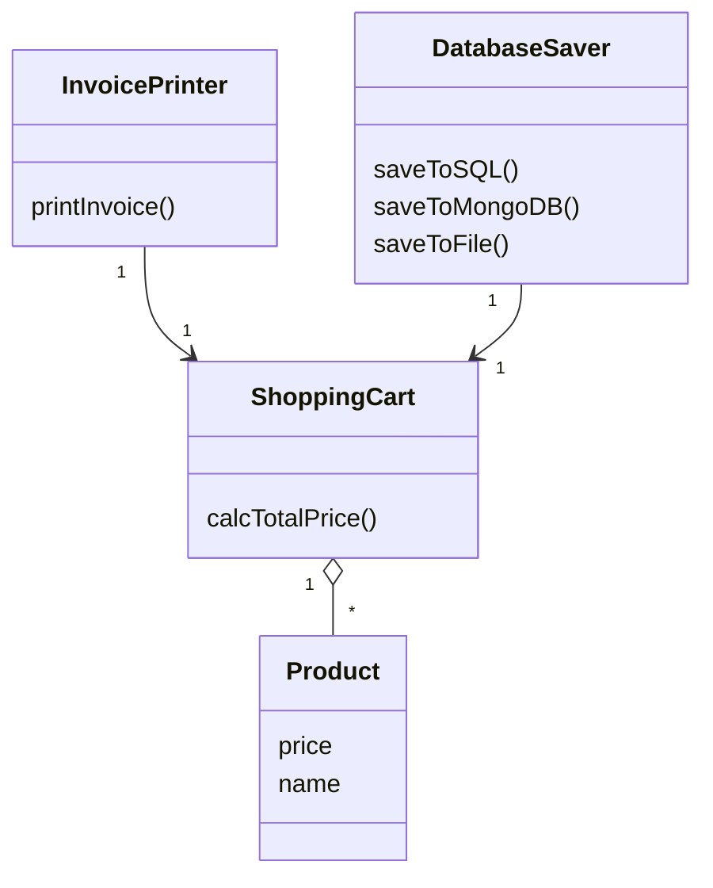
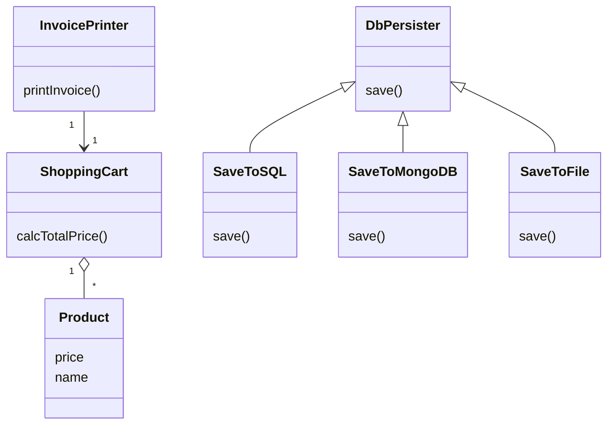

# OCP - Open Close Principle

## What is OCP?
OCP states that a class should be open for extension but closed for modification. In other words, we should be able to add new features to a class without modifying its existing code.

## Scenario
- Lets say we had previously saving the cart data to SQL db.
- Now we want to add the feature to save the cart data to NoSQL Database like MongoDB.
- And also want to add the data in a file.
- So here we need two more methods like `saveToMongoDB()` and `saveToFile()`.
- But to add this we need to modify the existing code of `saveToDB` class.
- And this design violates the OCP because we are modifying the existing code.

## UML Diagram (Before)

## Refactoring for OCP
- Create an abstract class(interface in Java) `DbPersister` with `save(cart)` method.
- Implement separate classes `SaveToSQL`, `SaveToMongoDB`, and `SaveToFile` inheriting from `DbPersister`.
- Each class provides its own `save()` implementation without changing existing code.

## UML Diagram (After)

