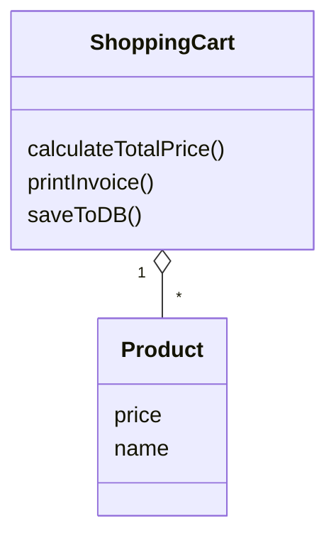
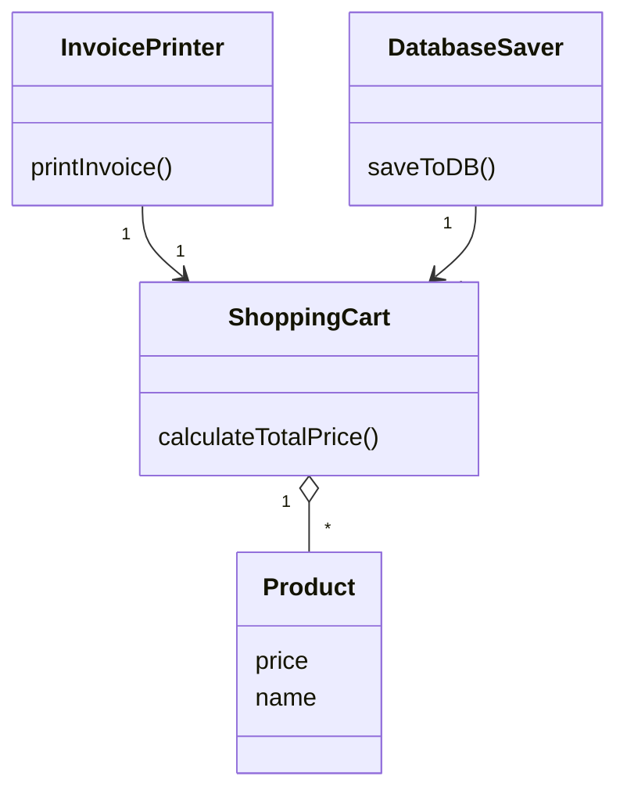

# SRP - Single Responsibility Principle

## What is SRP?
SRP states that a class should have only one reason to change. In other words, a class should have only one job or responsibility.

## Scenario
- We have a class `Product` and another class called `ShoppingCart`.
- We can have multiple products in a shopping cart.
- So `ShoppingCart` has one-to-many relation with `Product`.
- `ShoppingCart` is handling multiple responsibilities like calculating total price, printing invoice, and saving to database.
- Therefore, `ShoppingCart` has multiple reasons to change.
- This violates SRP.

## UML Diagram

## Refactoring for SRP
- Keep total price calculation in the `ShoppingCart` class.
- Move printing invoice and saving to database into separate classes.
- Both of these have a one-to-one relation with `ShoppingCart`.
- This way `ShoppingCart` has only one reason to change.
- Each new class has only one job or responsibility.

## UML Diagram (After)

